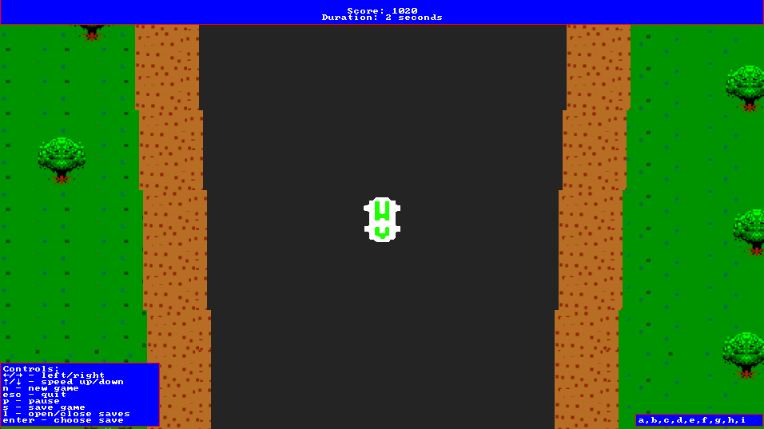

# Spy Hunter C++

This is a second project for a basics of programming course I did on my first term during my Informatics studies on Gdańsk University of Technology. This is a simple reproduction of [Spy Hunter](https://en.wikipedia.org/wiki/Spy_Hunter) arcade game.

It has implemented
- Graphics
- Player movement with acceleration/deacceleration
- Keeping the score
- Saving and restoring game state
- Changing the width of the road
- Pausing the game

Project was made using Visual Studio 2019 and can be opened by opening .sln file in main directory.
Enjoy!
